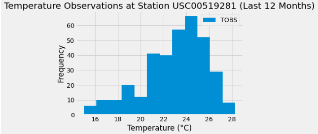

# Project Description
To analyse climate in Honolulu, Hawaii in preparation for a holiday. This project uses SQLAlchemy ORM queries, Pandas, and Matplotlib to perform basic data exploration, conduct an analysis of an SQlite database, and create a Flask App to showcase query results. This app ('Hawaii Weather Data API') enables of query of the weather data between a period span of 1 Jan 2010 to 23 Aug 2017.

## Analysis Results & Holiday Implications

This project started off with an analysis of the precipitation (rainfall) and produced a visualisation of the amount of rainfall over the past 12 months (23-08-2016 to 23-08-2017 at time of publishing). Temperature data collected from the most active weather station was further analysed to obtain the lowest, highest, and average temperatures. 

We are now able to see which months have the greatest amount of rainfall from our Bar Chart ('Precipitation Analysis_Hawaii.png') above. The plot suggests that March is the best time of the year to visit Hawaii given the relatively lower volumes of precipitation overserved between the span of 14-02-17 to 01-04-17. That is assuming that you prefer the sunny weather. If your preference is for heavy downpours, late August till end September would be your cup of tea. 

From the histogram above ('Aug2016-2017_USC00519281.png'), you can expect temperatures between 22-26 degrees celsius year round in Hawaii given that these temperatures were most frequently recorded in Hawaii.

## How to navigate the Hawaii Weather Data API

### Run this app on terminal with 'flask run' and access the local url provided.

Welcome page (/): Provides a list of all available routes and the respective queries served.

Daily Precipitation Totals for the Last 12 Months (/api/v1.0/precipitation)

List of Weather Stations (/api/v1.0/stations)

Temperature Observations for Most Active Station over Last 12 Months (/api/v1.0/tobs)

Min, Average & Max Temperatures from Start Date (/api/v1.0/<start>)

Min, Average & Max Temperatures for Date Range: (/api/v1.0/<start>/<end>)

NOTE: Please enter all 'start' and 'end' dates in yyyy-mm-dd format.

  
## Packages/Dependencies Used

matplotlin.pyplot

numpy

scipy.stats

pandas

datatime

sqlalchemy

## Contents of 'SurfsUp' Folder

'Resources' folder (contains starter csv files and sqlite database)

climate_analysis.ipnyb (Jupyter notebook containing analysis and data exploration)

Precipitation Analysis_Hawaii.png (Bar Chart of Rainfall Amount in Hawaii between 23 Aug 2016 to 23 Aug 2017)

Aug2016-2017_USC00519281.png (Histogram of Temperature Observation Data for most active weather station)
